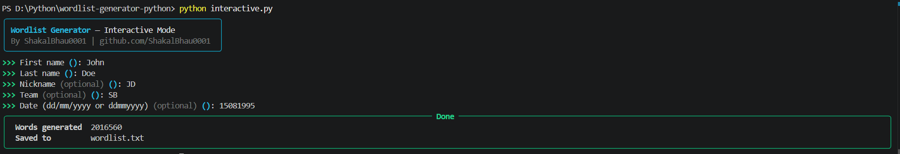

# 🔐 Wordlist Generator CLI (Python)

A complete and educational Python implementation of a targeted, keyword-based wordlist generator.
This project demonstrates token permutation, case/leetspeak variation, and numeric-tail expansion using structured logic.

It is created as a learning and academic project to understand how targeted password wordlists are built internally (for OSINT / penetration testing use-cases), not as a bulk dictionary-generation tool.

---

## 🧱 Project Structure

```bash
wordlist-generator-python-cli/
│
├── assets/             # Screenshots
├── main.py             # Basic CLI version
├── interactive.py      # Rich-powered interactive wizard
├── requirements.txt    # Dependencies
├── LICENSE             # Project license
└── README.md           # Project documentation
```

---

## ✨ Features

### 🔑 Personal-Info-Based Token Generation
- Accepts first name, last name, nickname, team/company, and date
- Cleans and normalizes each input into safe tokens
- Parses dates (`ddmmyyyy` / `ddmmyy`) into day, month, year, and combined sub-tokens
- Demonstrates structured, targeted wordlist construction

### 🔒 Word Building
- Permutes tokens (1 to 3 combined by default) in every order
- Joins combinations with `-`, `_`, `.`, or no separator
- Reads back the full permutation set to build the base wordlist

### 🎭 Variant Expansion
- Case variants: lower, UPPER, Capitalized, and CamelCase
- Leetspeak variants (`a→4`, `e→3`, `i→1`, `o→0`, `s→5`, `t→7`, `b→8`)
- Numeric tail suffixes (`00`–`99` and the last 10 years)
- Final length filtering (default: 7–24 characters)

### 🧮 Educational Focus
- Clean and readable logic
- Set-based deduplication throughout
- Ideal for beginners in OSINT / password-wordlist theory
- No external dependencies (Basic CLI)

### 🎨 Rich CLI (Interactive Mode)
- Beautiful colored terminal UI using Rich
- Guided wizard-style prompts with optional fields
- Animated spinner while generating
- Structured panel + table summary of results

### ⚡ Dual Mode Support
- 🧼 Basic CLI (`main.py`) → argparse flags, no dependencies
- 🎨 Rich CLI (`interactive.py`) → guided wizard with colors and panels

---

## 🛠 Technologies Used

| Technology              | Role                            |
| ------------------------| --------------------------------|
| **Python 3**            | Core programming language       |
| **argparse**            | Basic CLI flag parsing          |
| **itertools / re**      | Token permutation & cleaning    |
| **Rich**                | Styled interactive CLI          |

---

## 📌 Purpose of This Project

This project is built to:

- Understand targeted, personal-info-based wordlist generation
- Learn permutation and variant-expansion logic
- Explore how OSINT data (names, dates, nicknames) maps to password guesses
- Study case-transform and leetspeak substitution techniques

> **⚠️ This project is intended strictly for authorized penetration testing, learning, and demonstration purposes.**

---

## ▶️ How to Run

### 1️⃣ Clone the repository

```bash
git clone https://github.com/ShakalBhau0001/wordlist-generator-python-cli.git
```

### 2️⃣ Navigate to the project folder

```bash
cd wordlist-generator-python-cli
```

### 3️⃣ Install Dependencies

```bash
pip install rich
```

**OR**

```bash
pip install -r requirements.txt
```

### 4️⃣ Running the Project

#### Basic CLI Version

```bash
python main.py -f John -l Doe -n JD -t RedTeam -d 15081995
```

#### Rich Interactive Version

```bash
python interactive.py
```

### 5️⃣ Follow the prompts for Interactive Version
- Enter first name
- Enter last name
- Enter nickname *(optional)*
- Enter team/company *(optional)*
- Enter date `dd/mm/yyyy` or `ddmmyyyy` *(optional)*
- View the generated word count and saved file path

---

## 🔎 Example

> Basic CLI:

```bash
python main.py -f John -l Doe -n JD -t RedTeam -d 15081995

========================================
Wordlist Generator
========================================
Generating wordlist....
Generated 42218 words.
Saved to: wordlist.txt
```

> Custom output & length flags:

```bash
python main.py -f John -l Doe -o custom --min-len 8 --max-len 16
```

---

## ⚠️ Limitations

- Not a bulk/general-purpose dictionary generator
- Combination count grows fast with more tokens (`--max-combo`)
- Only ASCII alphanumerics plus `. _ -` are kept in tokens
- CLI-based interaction only

---

## 🌟 Future Improvements

- Add support for additional personal-info fields (pet name, city, etc.)
- Smarter leetspeak (multi-substitution combinations)
- Progress bar for the Basic CLI version
- Add input validation enhancements
- Export directly in Hashcat/John-compatible formats

---

## ⚠️ Disclaimer

> This implementation is created **_for educational and learning purposes only._**

> **_Use this tool only on systems and accounts you own or are explicitly authorized to test. The author is not responsible for any misuse._**

---

## 📸 Preview



---

## 🪪 Author

> **Creator: Shakal Bhau**

> **GitHub: [ShakalBhau0001](https://github.com/ShakalBhau0001)**

---

## ⭐ Support

If you like this project, consider giving it a ⭐ on GitHub!

---
